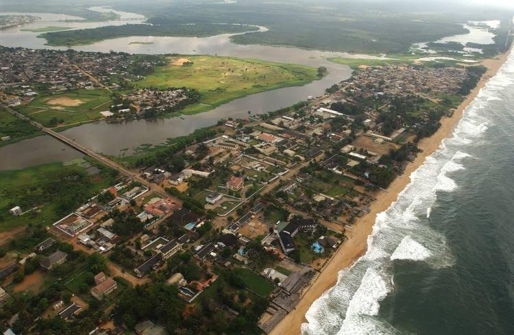

# State of the Map Africa 2019 is here!
State of the Map Africa 2019 is just around the corner and we are excited to welcome you all to Abidjan and Grand-Bassam, Ivory Coast from the 22nd to 24th November 2019 for the conference.

Here is some information to make planning for your trip to Ivory Coast easier.

## Registration:
Tickets are on sale here. Early bird tickets are available till the 25th of October at 50 USD for participants from Africa and 100 USD for participants from the Rest of the World. After that, the tickets will go for 100 USD for Africa Participants and 200 USD for the rest of the world. We also have a corporate/business ticket going for 350 USD

## Venue:
We have two venues for the conference
**Day 1, 22nd November:**  **[Latrille Event](https://www.openstreetmap.org/way/286243318)**, Cocody II Plateau, Abidjan, Ivory Coast 
Joint event with the [Understand Risk West and Central Africa](https://understandrisk.org/event/understanding-risk-west-and-central-africa/) Conference
 
**Day 2 and 3, 23rd and 24th November:** **[VITIB](https://www.openstreetmap.org/way/418991195)**, Grand-Bassam, Ivory Coast 

## Accommodation
You can book for accommodation in Grand-Bassam for all the three days of the conference. Bus transportation will be provided free of charge on day 1 of the conference to take participants from Grand Bassam to Abidjan and back, a distance of 40 km

There are dozens of convenient and affordable places to say in Grand-Bassam. Most of the recommended hotels for accommodation are within the town in a range of 5-8 km distance to VITIB, the conference venue. Public transport costs less than a dollar to VITIB

<iframe width="100%" height="300px" frameborder="0" allowfullscreen src="https://umap.openstreetmap.fr/en/map/grand-bassam_376435?scaleControl=false&miniMap=false&scrollWheelZoom=false&zoomControl=true&allowEdit=false&moreControl=false&searchControl=null&tilelayersControl=null&embedControl=null&datalayersControl=true&onLoadPanel=caption&captionBar=false"></iframe>

Make your choice from the following list recommended by the local organizing committee 

| Hotel | Price Range(USD)| Distance to Venue |
| -------- | -------- | -------- |
| [Assoyam Beach](https://www.assoyam.com/index.php)   | 102 USD - 255 USD   | [8.6km ](https://www.openstreetmap.org/directions?engine=fossgis_osrm_car&route=5.2274%2C-3.7592%3B5.1959%2C-3.7433#map=14/5.2135/-3.7429)   |
| [Afrikland Hôtel](https://afriklandhotel.com/) | 178 USD - 365 USD | [7.2km](https://www.openstreetmap.org/directions?engine=fossgis_osrm_car&route=5.2274%2C-3.7592%3B5.2027%2C-3.7365#map=14/5.2170/-3.7429) |
| [La Taverne Bassamoise](http://www.taverne-bassamoise.fr) | 49 USD - 58 USD |[8.1km](https://www.openstreetmap.org/directions?engine=fossgis_osrm_car&route=5.2274%2C-3.7592%3B5.1956%2C-3.7399) |
| [La Madrague](http://www.hotellamadrague.com/) | 51 USD - 76 USD | [8.3km](https://www.openstreetmap.org/directions?engine=fossgis_osrm_car&route=5.23%2C-3.76%3B5.20%2C-3.74#map=14/5.2133/-3.7429) |
| [Maffouet Hôtel](http://www.maffouethotel.ci/index.php) | 50 USD - 97 USD | [6.0km](https://www.openstreetmap.org/directions?engine=fossgis_osrm_car&route=5.2169%2C-3.7423%3B5.2274%2C-3.7592#map=15/5.2242/-3.7445) |
| [La Paillote](http://www.lapaillotegrandbassam.com/la_paillote/) | 60 USD - 76 USD | [8.5km](https://www.openstreetmap.org/directions?engine=fossgis_osrm_car&route=5.2274%2C-3.7592%3B5.1938%2C-3.7326#map=14/5.2126/-3.7429) |
| [N’Sa Hôtel](http://www.nsahotel.com/) | 60 USD - 144 USD | [5.8km](https://www.openstreetmap.org/directions?engine=fossgis_osrm_car&route=5.2274%2C-3.7592%3B5.2184%2C-3.7421#map=15/5.2244/-3.7446) |
| [La Playa](https://www.laplaya-ci.com/) | 60 USD - 178 USD | [8.3km](https://www.openstreetmap.org/directions?engine=fossgis_osrm_car&route=5.2274%2C-3.7592%3B5.1956%2C-3.7411#map=14/5.2134/-3.7429) |

**Visas**
Read the [Visa Polity of Ivory Coast here](https://en.wikipedia.org/wiki/Visa_policy_of_Ivory_Coast), for those that need a visa, you can apply for an electronic-visa here **https://snedai.com/e-visa/** that if approved can be picked up at the Port Bouet Airport in Abidjan. The eVisa is valid for 90 days and is issued within 48 hours
 

"Visa policy of Cote d'Ivoire" by [Twofortnights](https://commons.wikimedia.org/wiki/User:Twofortnights), [CC BY-SA 3.0](https://creativecommons.org/licenses/by-sa/3.0)

In case you need a visa support letter, please reach out at sotmafrica@gmail.com after registration and we will send you one.

## Transportation

#### Flights
The easiest way to get to Grand Bassam is through the [Félix-Houphouët-Boigny International Airport](https://en.wikipedia.org/wiki/F%C3%A9lix-Houphou%C3%ABt-Boigny_International_Airport), also known as *Port Bouët Airport*, is the main hub of the national airline Air Côte d'Ivoire; that offers connections to a number of destinations in West and East Africa. Abidjan is well-connected internationally with regular flights on:

- [Air Côte d'Ivoire](https://www.aircotedivoire.com/)
- [Air France](http://www.airfrance.com/)
- [Brussels Airlines](https://www.brusselsairlines.com/)
- [Egyptair](http://www.egyptair.com/)
- [Emirates](http://www.emirates.com/) via Accra
- [Ethiopian Airlines](http://www.flyethiopian.com/)
- [Kenya Airways](http://www.kenya-airways.com/)
- [Middle East Airlines](http://www.mea.com.lb/) via Accra or Lagos
- [TAP Air Portugal](https://www.flytap.com/en-pt/)
- [Turkish Airlines](http://www.turkishairlines.com/)
- [Royal Air Maroc](http://www.royalairmaroc.com/)

#### Airport to Grand-Bassam

From the Airport to Grand-Bassam is only 24 Km from the which takes about [30 minutes by road](http://bit.ly/2L6tdZq). 

Bush taxis from the Gare de Bassam in Abidjan are the best option, and will cost about **500 CFA**. Buses are an alternative, which leave from Gare Routière d'Adjamé in Abidjan for **500 CFA**. Grand-Bassam's 1 gare routière (bus station) is in the centre of town, just beside the Place de Paix roundabout. Getting around the town is largely divided into two distinct halves. On the south side of the Ébrié Lagoon is Ancien Bassam, the old French town where most of the colonial buildings and attractions are located. Nouveau Bassam lies to the north of the lagoon, and grew out of the old servant quarters to become the main business centre. The two are connected by a small bridge. The main area of town is quite compact, so walking is an easy way of getting around. If you feel like venturing further, you will need to organise a bush taxi.

#### Travelling by Road

 - [STC](https://stc.gov.gh/fares/) - From Accra and Cotonou to Abidjan
For those planning to travel to Abidjan and Grand Bassam by bus, there are many different connections to the neighbouring countries. You can plan your trip [here](https://www.rome2rio.com/map/Abidjan) 

